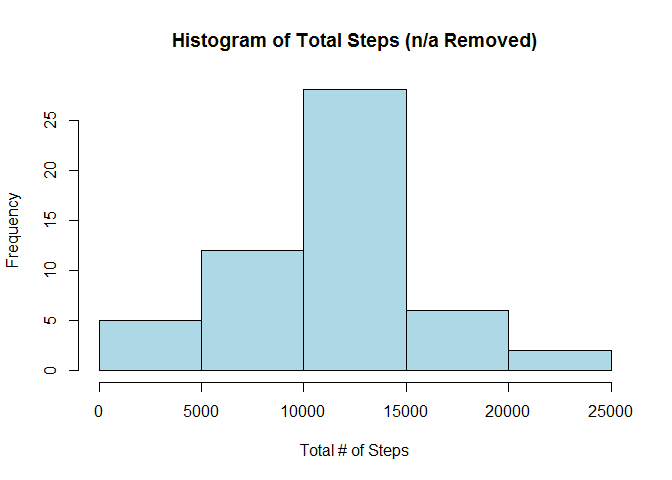
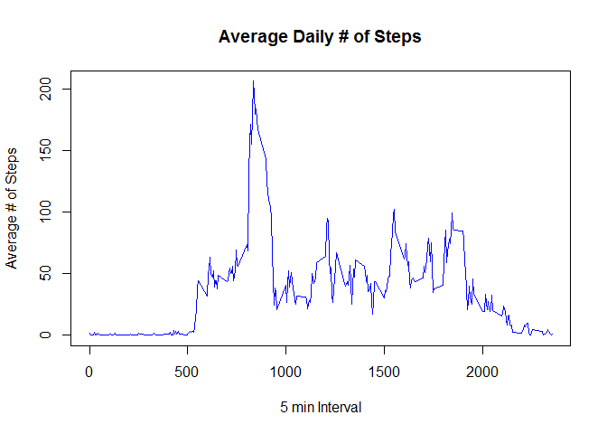
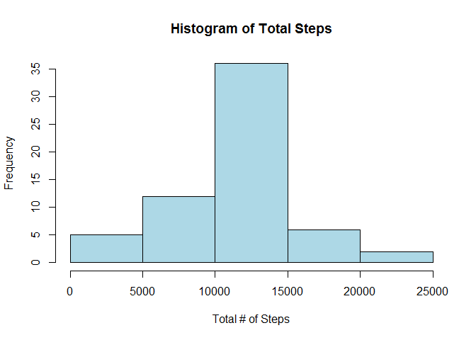

# Reproducible Research - Course Project 1
kimsanders82  
June 11, 2017  


# Assignment  

### This assignment will be described in multiple parts. You will need to write a report that answers the questions detailed below. Ultimately, you will need to complete the entire assignment in a single R markdown document that can be processed by knitr and be transformed into an HTML file.

### Throughout your report make sure you always include the code that you used to generate the output you present. When writing code chunks in the R markdown document, always use echo = TRUE so that someone else will be able to read the code. This assignment will be evaluated via peer assessment so it is essential that your peer evaluators be able to review the code for your analysis.

### For the plotting aspects of this assignment, feel free to use any plotting system in R (i.e., base, lattice, ggplot2)

### Fork/clone the GitHub repository created for this assignment. You will submit this assignment by pushing your completed files into your forked repository on GitHub. The assignment submission will consist of the URL to your GitHub repository and the SHA-1 commit ID for your repository state.

### NOTE: The GitHub repository also contains the dataset for the assignment so you do not have to download the data separately.

## Load applicable libraries needed for analysis


```r
library(lubridate)
library(dplyr)
library(lattice)
```

## Set the working directory


```r
setwd("C:/Coursera")
```

# Loading and preprocessing the data

## Load the data


```r
if (!file.exists("activity.csv")) {
    unzip("activity.zip")
}
activity <- read.csv("activity.csv")
str(activity)
```

```
## 'data.frame':	17568 obs. of  3 variables:
##  $ steps   : int  NA NA NA NA NA NA NA NA NA NA ...
##  $ date    : Factor w/ 61 levels "2012-10-01","2012-10-02",..: 1 1 1 1 1 1 1 1 1 1 ...
##  $ interval: int  0 5 10 15 20 25 30 35 40 45 ...
```

## Process/transform the data (if necessary) into a format suitable for your analysis


```r
activity$date <- as.Date(activity$date)
summary(activity)
```

```
##      steps             date               interval     
##  Min.   :  0.00   Min.   :2012-10-01   Min.   :   0.0  
##  1st Qu.:  0.00   1st Qu.:2012-10-16   1st Qu.: 588.8  
##  Median :  0.00   Median :2012-10-31   Median :1177.5  
##  Mean   : 37.38   Mean   :2012-10-31   Mean   :1177.5  
##  3rd Qu.: 12.00   3rd Qu.:2012-11-15   3rd Qu.:1766.2  
##  Max.   :806.00   Max.   :2012-11-30   Max.   :2355.0  
##  NA's   :2304
```

```r
tidyData <- activity[complete.cases(activity), ]
```

# What is mean total number of steps taken per day?

### For this part of the assignment, you can ignore the missing values in the dataset.

## Make a histogram of the total number of steps taken each day


```r
q1Data <- tidyData %>%
  group_by(date) %>%
  summarize(totalSteps = sum(steps))

hist(q1Data$totalSteps, xlab = "Total # of Steps", main = "Histogram of Total Steps (n/a Removed)", col = "lightblue")  
```

<!-- -->

## Calculate and report the mean and median total number of steps taken per day


```r
options(scipen = 2)
q2Data <- q1Data %>% 
  summarize(meanSteps = mean(totalSteps), medianSteps = median(totalSteps))
```

### The mean number of steps is 10766.1886792 and the median number of steps is 10765.

# What is the average daily activity pattern?

## Make a time series plot (i.e. type = "l") of the 5-minute interval (x-axis) and the average number of steps taken, averaged across all days (y-axis)


```r
timeSeriesData <- tidyData %>%
           group_by(interval) %>%
           summarise(stepsMean=mean(steps))
with(timeSeriesData, plot(interval, stepsMean, type="l", col="blue", main="Average Daily # of Steps",
                    xlab="5 min Interval", ylab="Average # of Steps"))
```

<!-- -->

## Which 5-minute interval, on average across all the days in the dataset, contains the maximum number of steps?


```r
maxInterval <- max(timeSeriesData$stepsMean)
maxInterval <- filter(timeSeriesData, stepsMean %in% c(maxInterval))
```

### The 5-minute interval 835 contains the maximum number of steps (206.1698113)

# Imputing missing values

### Note that there are a number of days/intervals where there are missing values (coded as NA). The presence of missing days may introduce bias into some calculations or summaries of the data.

## Calculate and report the total number of missing values in the dataset (i.e. the total number of rows with NAs)


```r
missingInfo <- nrow(activity) - nrow(tidyData)
```

### There are 2304 rows with missing data.

## Devise a strategy for filling in all of the missing values in the dataset. The strategy does not need to be sophisticated. For example, you could use the mean/median for that day, or the mean for that 5-minute interval, etc.

### Strategy: The NA values will be replaced by the mean value for the day as calculated in the above time series data

## Create a new dataset that is equal to the original dataset but with the missing data filled in.


```r
newData<- inner_join(activity, timeSeriesData) %>% # join the mean steps value to each row in activity
          mutate(steps = ifelse(is.na(steps), stepsMean, steps)) %>% # only fill in mean if steps is NA
          select(-stepsMean) # drop excess column used to fill in NA values
```

##Make a histogram of the total number of steps taken each day and Calculate and report the mean and median total number of steps taken per day. Do these values differ from the estimates from the first part of the assignment? What is the impact of imputing missing data on the estimates of the total daily number of steps?


```r
q1NewData <- newData %>%
  group_by(date) %>%
  summarize(totalSteps = sum(steps))

hist(q1NewData$totalSteps, xlab = "Total # of Steps", main = "Histogram of Total Steps", col = "lightblue")  
```

<!-- -->


```r
options(scipen = 2)
q2NewData <- q1NewData %>% 
  summarize(meanSteps = round(mean(totalSteps),0), medianSteps = median(totalSteps))
```

### The mean number of steps is 10766 and the median number of steps is 10766.1886792.  

### Imputing values for the NA entries slightly changes the mean and median values. The overall shapes of the histograms are similar. There is not a significant change in the results.

# Are there differences in activity patterns between weekdays and weekends?

### For this part the weekdays() function may be of some help here. Use the dataset with the filled-in missing values for this part.

## Create a new factor variable in the dataset with two levels -- "weekday" and "weekend" indicating whether a given date is a weekday or weekend day.


```r
weekData <- newData %>% 
         mutate(day=as.factor(ifelse(wday(date) %in% c(1,7),"weekend","weekday")))
```

## Make a panel plot containing a time series plot (i.e. type = "l") of the 5-minute interval (x-axis) and the average number of steps taken, averaged across all weekday days or weekend days (y-axis). 


```r
panelData <- weekData %>% 
          group_by(day, interval) %>%
          summarise(stepsMean = mean(steps))
with (panelData, 
      xyplot(stepsMean ~ interval|day, type = "l", 
             xlab = "Interval", ylab = "Number of Steps",layout=c(1,2)))
```

<!-- -->


